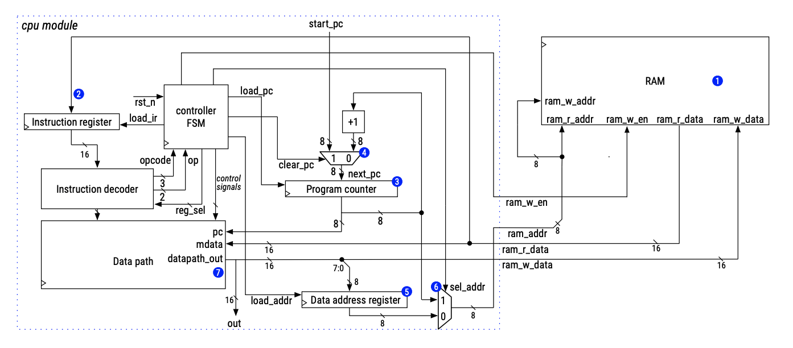
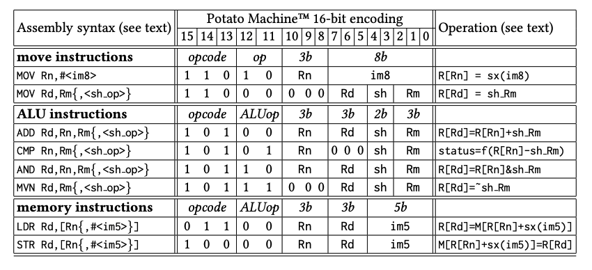

# 16-bit RISC Machine

The 16-bit RISC Machine project represented the culmination of our CPEN 211 class, where my partner and I took on the task of designing a fundamental Central Processing Unit (CPU) architecture. The project included a complete hardware implementation using SystemVerilog, consisting of components including a FSM (Finite State Machine) controller, instruction decoder, Arithmetic Logic Unit (ALU), register file, memory unit, and program counter.

To validate the correctness of each individual component and the CPU as a complete system, my partner and I wrote a set of testbenches using SystemVerilog and executed them in ModelSim. This allowed us to identify failures in specific modules and test the integration of the CPU components.

The code is available uppon request. Please send an email to [eomielan@gmail.com](mailto:eomielan@gmail.com) or [ljiawen49@gmail.com](mailto:ljiawen49@gmail.com).

## Diagram

## Supported Instructions

